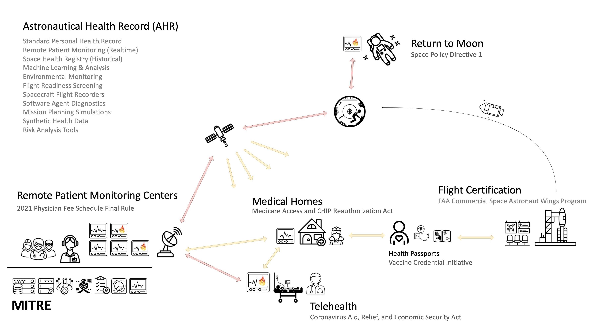

## Introduction
Welcome to the Aerospace Medicine Implementation Guide (IG) for the Synthea Synthetic Patient Generation utility. This guide documents a standardized approach for modeling and exchanging health and medical data in aerospace environments using the Fast Healthcare Interoperability Resources (FHIR) specification. The goal of this IG is to bridge the gap between terrestrial healthcare informatics and the emerging needs of space medicine by enabling consistent, interoperable simulation and data exchange across mission profiles, devices, and care environments.

This guide is intended for developers, researchers, mission planners, medical device manufacturers, and clinicians who are designing, evaluating, or simulating health monitoring systems in aerospace domains—from commercial space tourism to long-duration crewed missions. It provides the data schemas, usage patterns, and practical mappings needed to support synthetic patient generation and interoperability across the continuum of spaceflight health data—from pre-launch screening to in-flight telemetry to post-mission rehabilitation.

{:width="100%"}  

### Installation  

```bash 
# install the sushi tool
git clone https://github.com/FHIR/sushi
npm install -g fsh-sushi
sushi --help

# clone the repository
git clone https://..../aerospace-health-ig
cd aerospace-health-ig

# compile the documentation  
./_updatePublisher.sh
./_build.sh

# open the documentation (assuming Mac + Chrome)
open output/index.html
```

#### License  
This project is licensed under the Apache License. See the `LICENSE` file for details.

#### Release Statement and Copyright

Approved for Public Release; Distribution Unlimited. Public Release Case Number 25-1124.

©2025 The MITRE Corporation. ALL RIGHTS RESERVED. 